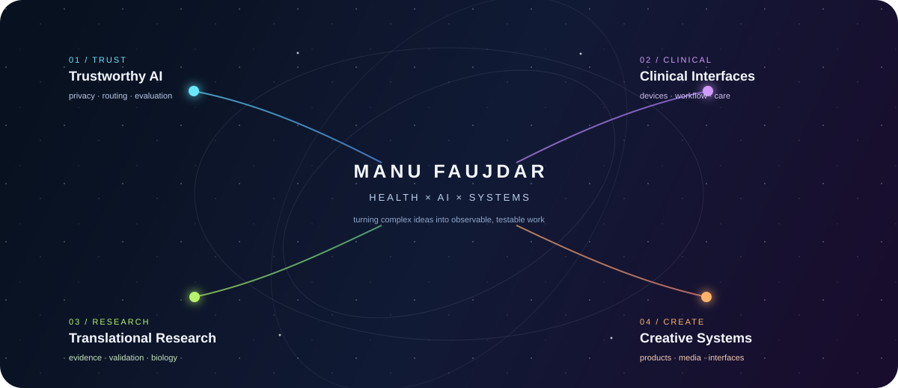
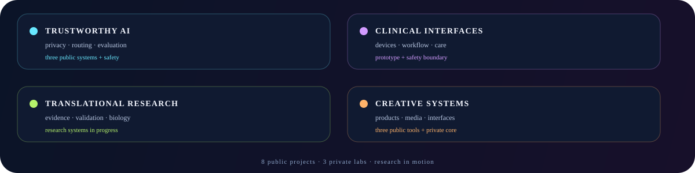

<h1>Manu Faujdar</h1>

<strong>Healthtech builder · Translational AI researcher · Creative systems designer</strong>

  <a href="https://masterllm.ai">Master LLM</a> ·
  <a href="https://github.com/manufaujdar/ai-routing-gateway">AI Gateway</a> ·
  <a href="https://github.com/manufaujdar/smart-glasses">Smart Glasses</a> ·
  <a href="https://www.linkedin.com/in/dr-manu-faujdar-0a410a1b8">LinkedIn</a>

<table>
<tr>
<td width="25%" align="center">◈ <strong>TRUST</strong> privacy · safety · evaluation</td>
<td width="25%" align="center">⌁ <strong>CLINICAL</strong> workflow · devices · care</td>
<td width="25%" align="center">◌ <strong>RESEARCH</strong> evidence · validation · translation</td>
<td width="25%" align="center">✦ <strong>CREATE</strong> products · media · interfaces</td>
</tr>
</table>

I build systems that make complex technology more **observable, safe, and useful**—from AI routing and privacy controls to clinical devices, translational research tools, and creative AI products.

## Selected public work

<table>
<tr>
<td width="50%" valign="top">

### ◈ AI Routing Gateway
Explainable model and tool routing with deterministic decisions, specialist-agent workflows, and explicit safety boundaries.

<a href="https://github.com/manufaujdar/ai-routing-gateway">Explore repository →</a>

</td>
<td width="50%" valign="top">

### ⌁ Smart Glasses
Vendor-neutral healthcare smart-glasses research with capability contracts, simulators, safe-stop behavior, and workflow experiments.

<a href="https://github.com/manufaujdar/smart-glasses">Explore repository →</a>

</td>
</tr>
</table>

## The wider portfolio

`AI safety` · `model evaluation` · `clinical workflow` · `smart devices` · `biomarkers` · `digital health` · `creative AI`

The public repositories are the visible edge of a larger portfolio of private product labs and research systems. Private work is intentionally represented as a visual category rather than linked before it has a safe public release, complete documentation, and a reproducible demo.

## Working principles

| ◈ Observable | ⌁ Bounded | ◌ Resilient | ✦ Memorable |
|---|---|---|---|
| Make decisions inspectable | Make evidence and non-use explicit | Design for graceful failure | Give complex systems a human interface |

## Now

Turning separate experiments into a small set of coherent, testable health-AI and creative-system flagships.

<a href="https://manufaujdar.com"><strong>Build with me →</strong></a>

<!--
  Design note: keep the profile visual and sparse. Project details belong in
  repositories; this page is the map, not the archive.
-->
